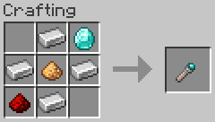
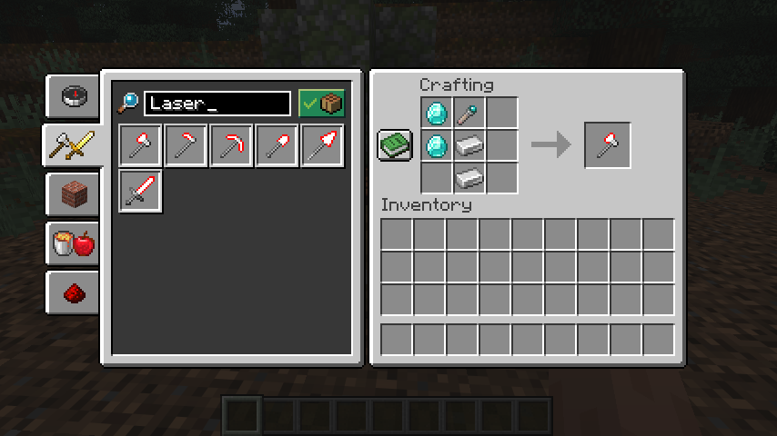
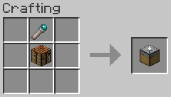
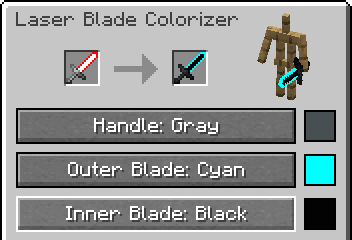

# LaserBlade-Tools

A Minecraft mod to add laser blade tools.

Laser blade tools are tool items with laser blades.
They have performance comparable to diamond tools.

## Download Mod

- [Modrinth](https://modrinth.com/mod/laserblade-tools)
- [CurseForge](https://www.curseforge.com/minecraft/mc-mods/laserblade-tools)

## Requirements

- Minecraft 26.1.2
- NeoForge version - NeoForge
- Forge version - Minecraft Forge
- Fabric version - Fabric Loader and Fabric API

## How to Get Started

### 1. Craft a Laser Blade Core

A laser blade core is the crafting and repair material for laser blade tools.

### 2. Craft a Laser Blade Tool

Laser blade tools:

- Laser Blade Axe
- Laser Blade Hoe
- Laser Blade Pickaxe
- Laser Blade Shovel
- Laser Blade Spear
- Laser Blade Sword

\*Laser blades may be incompatible with some video options, some graphics improvement mods, and some shader packs.

The colors of laser blade tools can be changed using a laser blade colorizer block.

### 3. Recolor a Laser Blade Tool

A laser blade colorizer is a utility block used to change the colors of laser blade tools.

The interface is accessed by using (right-clicking) a placed laser blade colorizer.

The procedure for changing the colors of laser blade tools is as follows:

1. Place a laser blade tool in the input slot on the left side of the interface
2. Press the cycle buttons below to select the color of each part
3. Take the recolored laser blade tool from the result slot in the center

\*To change the color of the outer blade, the handle color must be set.
Likewise, to change the color of the inner blade, the outer blade color must be set.
